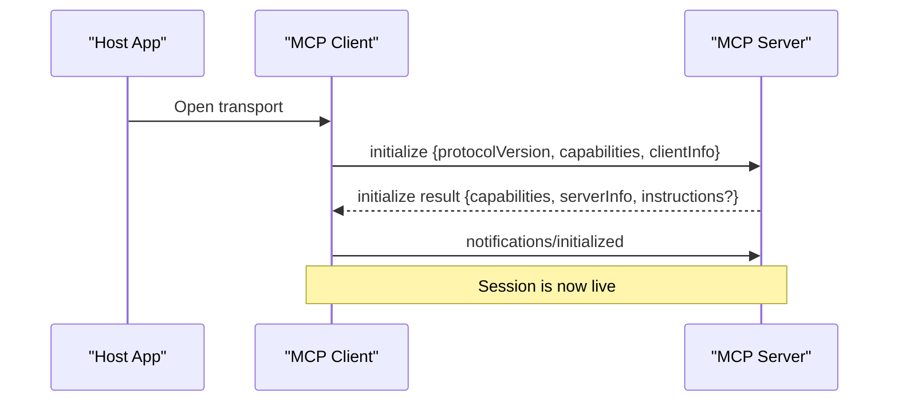
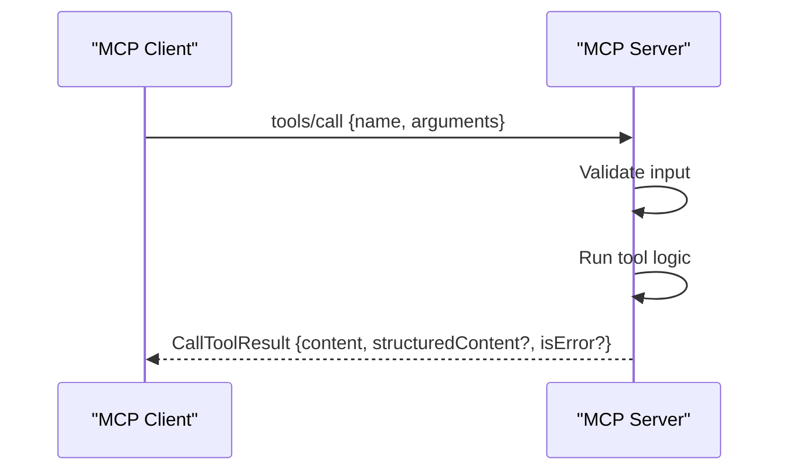
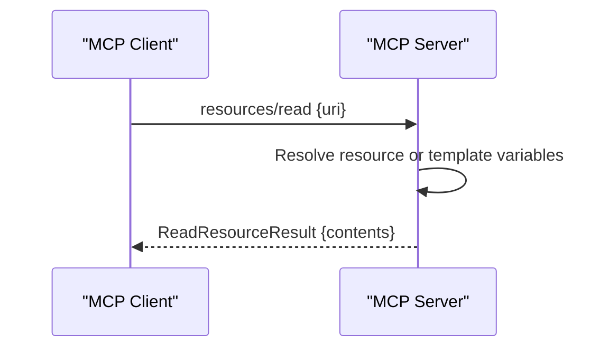
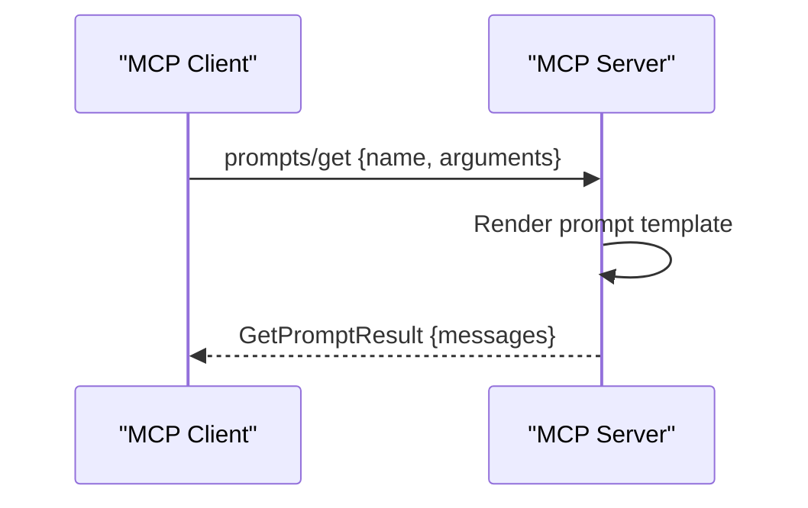
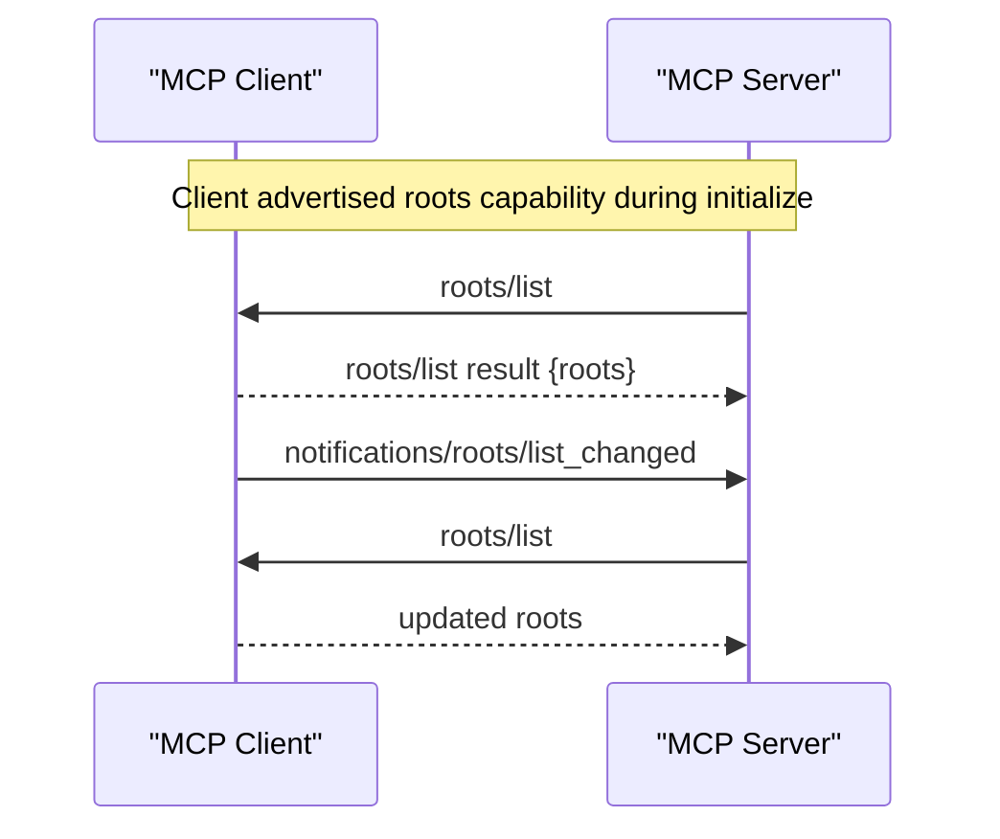
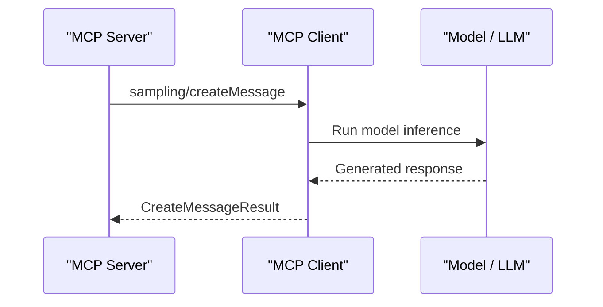
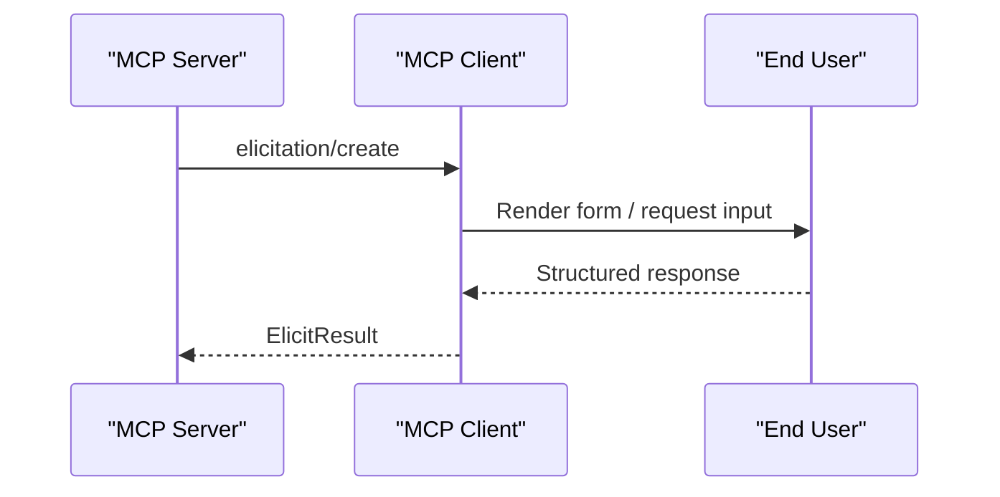
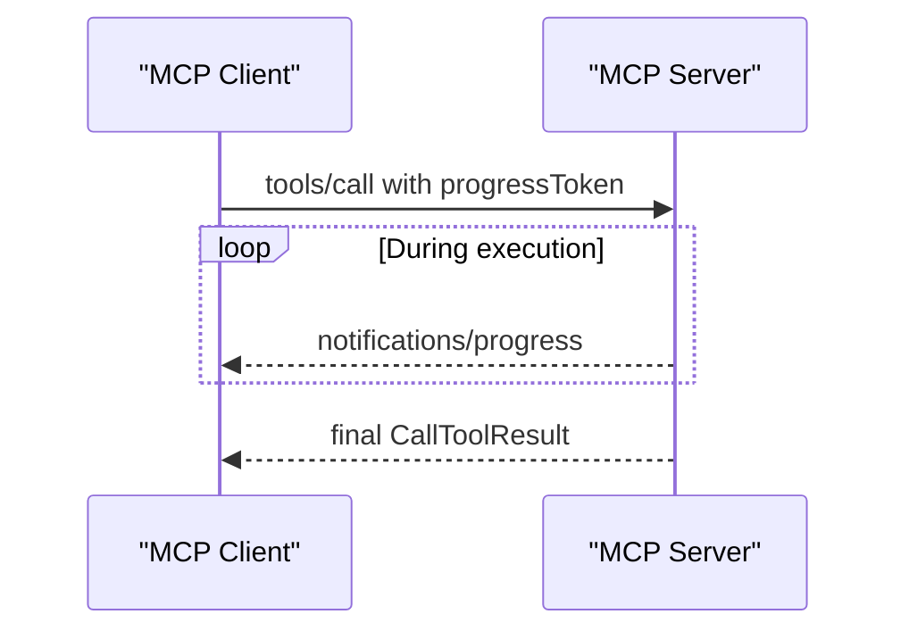
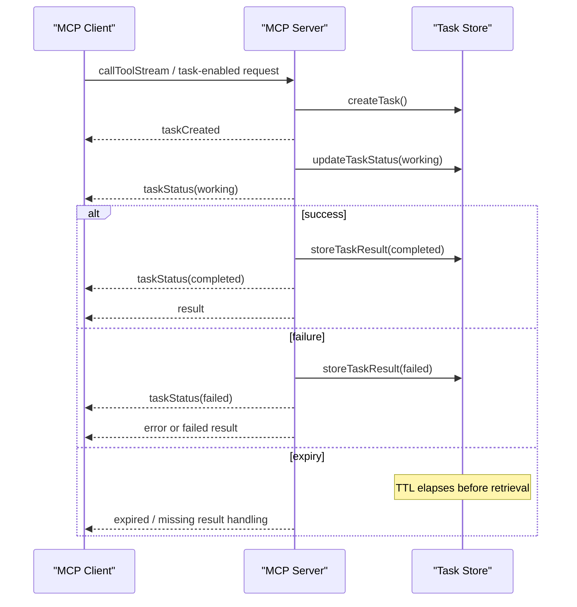
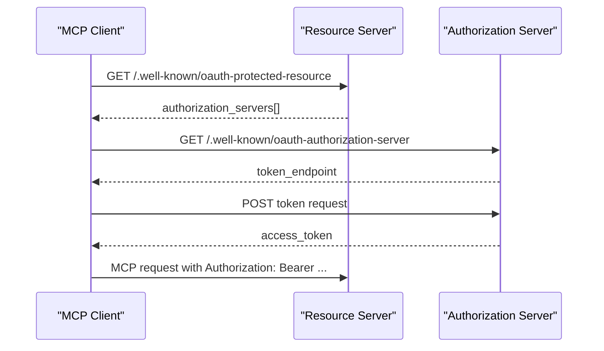

# MCP Protocol Flow Diagrams

These are simplified, practical flow diagrams for the protocol interactions you
see across the demos in this repository.

## 1. Initialize / Initialized

Use this flow in every transport. The transport changes how messages move, not
the logical handshake itself.

## 2. Tool Call

Use tools when you need action, side effects, or code execution.

## 3. Resource Read

Use resources when the model should read data rather than invoke behavior.

## 4. Prompt Get

Use prompts when you want reusable, named prompt templates rather than raw tool
behavior.

## 5. Roots

Roots are one of the key “direction reversal” features in MCP: the server asks
the client for data.

## 6. Sampling

Sampling is the server asking the client/model side to generate.

## 7. Elicitation

Elicitation is the server asking the user for structured input in the middle of
an operation.

## 8. Progress Notifications

Use progress when a single request remains active and the user needs
intermediate status.

## 9. Tasks Lifecycle

Use tasks when the lifecycle matters more than one immediate blocking response.

## 10. OAuth Discovery Chain

This is the discovery-first auth model that prevents clients from hardcoding
token endpoints.
